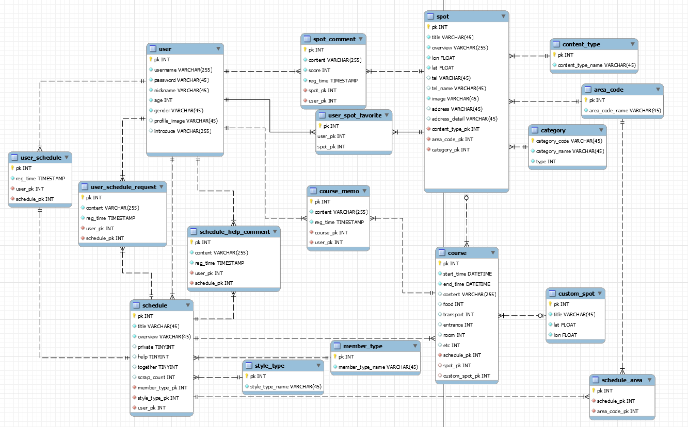
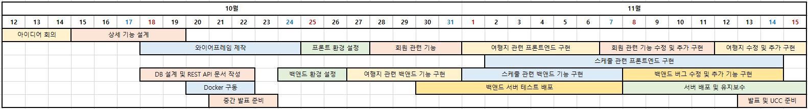

<div align=center></div>

<h2 align=center>A505 - 5늘여행가조</h2>

<div align=center>
    
    
    
    
    
    
    
</div>

<div></div>

<h3 align=center><a href="http://k3a505.p.ssafy.io/">사이트 바로가기</a></h3>

<div align=center>
    국내의 여행지 정보를 한 눈에 확인하고, 여행지에 대한 경험을 공유해주세요.<br>
    각자의 여행 계획을 공유하며 도움을 주고, 함께 여행할 여행 메이트를 구할 수도 있습니다.
</div>


## :book: 목차

### :rocket: [프로젝트 소개](#프로젝트-소개)

### :gear: [기획 단계](#기획-단계)

- ERD
- 기타 (와이어프레임 / API 문서 / 추천 시스템 소개)

### :package: [개발 환경](#개발-환경)​

* Frontend / Backend의 사용 Package
* 코드 실행 방법

### :family_man_man_girl_boy:  [팀원 소개](#팀원-소개)


## 프로젝트 소개

> **Travel Scheduler, Traduler**
>
> 여행의 시작과 끝에서 여러분과 함께 하며 행복한 추억을 만들 수 있는
>
> 여행의 동반자가 되도록 노력하겠습니다.

많은 사람들이 사회적인 이슈로 인해 힘든 시기를 보내고 있습니다.

하지만 동시에 이러한 이슈는 국내 여행에 대한 관심이 높아지는 계기가 되기도 했습니다.

저희는 높아진 국내 여행 수요에 대응하여 여행의 시작부터 

더 편하게 여행 스케줄을 관리할 수 있는 서비스인 Traduler를 제작하게 되었습니다.


## 기획 단계

### ERD

> 여행지와 스케줄, 유저의 기능들이 유기적으로 연결되어 있습니다.
>
> 또한, 스케줄과 여행 코스, 그에 대한 메모 등 다양한 Table이 연결되어 있기 때문에,
>
> 그를 효율적으로 활용하기 위해서 ERD를 작성했습니다.




### 기타

* [와이어프레임](https://xd.adobe.com/view/f9960554-7ac0-4af5-addd-f428e40306f7-acc5/)
  * Adobe XD를 활용하여 와이어프레임을 제작했습니다.
* [API Documentation](document/REST_API_document.md)
  * RESTful 서버의 API 문서입니다.


## 개발 환경

### Frontend 구성 요소

|     Package     | Version | Comment                                          |
| :-------------: | :-----: | :----------------------------------------------- |
|   vue-router    |  3.2.0  | 요청 URL에 따라 브라우저에서 돔을 변경           |
|      vuex       |  3.4.0  | 상태 관리 패턴 + 라이브러리                      |
|   vue-cookies   |  1.7.4  | 로그인 상태를 유지하기 위해 사용 (token 저장)    |
|      axios      | 0.21.0  | REST API 서버로부터 데이터를 받아오기 위해 사용  |
|     vuetify     | 2.2.11  | UI를 효율적으로 구성하기 위해 사용               |
| vue-multiselect |  2.1.6  | 여행지 검색 기능을 효율적으로 구현하기 위해 사용 |
|    firebase     | 2.29.1  | 날짜 포맷을 변경하기 위해 사용                   |

### Backend 구성 요소

|    Django 라이브러리    | Version | Comment                                             |
| :---------------------: | :-----: | :-------------------------------------------------- |
|         Django          | 2.1.15  | 중고마켓 관련 백앤드 구성을 위해 사용               |
|   djangorestframework   | 3.10.3  | RESTful API 서버를 쉽게 구축하기 위한 라이브러리    |
| djangorestframework-jwt | 1.11.0  | Django에서 JWT를 활용하기 위해 사용                 |
|        drf-yasg         | 1.17.1  | Django REST framework API를 문서화하기 위해 사용    |
|         PyMySQL         | 0.10.1  | 데이터베이스 커넥터 / MySQL 서버와 통신을 위해 사용 |
|         pandas          |  8.0.1  | 이미지를 효율적으로 업로드하고, 활용하기 위해 사용  |


### [코드 실행 방법](document/how_to.md)


## 팀원 소개

### 🍀 Among Earth 팀

* **권경은** - *PM, backend*- [chriskwon96](https://lab.ssafy.com/chriskwon96)
* **강찬엽** - *frontend* - [kang941194](https://lab.ssafy.com/kang941194)
* **김현성** - *frontend* - [khs0783](https://lab.ssafy.com/khs0783)
* **이동혁** - *backend, frontend*- [lee33843](https://lab.ssafy.com/lee33843)


### :star: Git Branch 전략

### branch

```bash
(master) -> (develop) -> (develop-front / back) -> (feature/feature명)
```

* master : 배포 가능한 상태로 유지
* develop : 개발용 최상위 branch
* front / back / data
    * front : Frontend 개발 branch
    * back : Backend 개발 branch
* Fetaure : 기능별 branch
* Hotfix : 급한 버그 수정이 필요한 경우 버그 수정 branch

### commit

```bash
[이름] Feature / 행위 + 설명 | 지라 이슈 번호로 구성 
    예시]
        [DH] Login / FIX bugs from login modal
        [DH] README / ADD README.md
```

### merge

```bash
merge 하기 전에 현재 작업 진행 상황 공유
merge 권한은 모두가 가지고 있지만 같은 팀의 다른 사람에게 리뷰 신청 후 merge 하기
merge 후 불필요한 branch 지우기
```


### :calendar: 개발 일정

